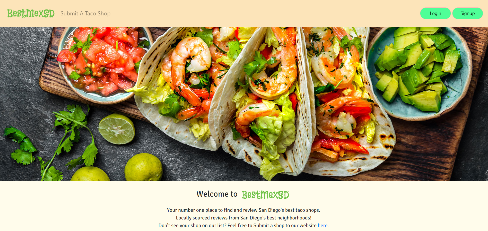

# BESTMEXSD - 

## SCREENSHOT OF APP

This deployed app can be viewed at: https://bestmexsd-appage.herokuapp.com/   

    
    
    
    

  

    
    
    
    
    
    
    <!--  -->

## DESCRIPTION

This is a fantastic app that makes it easy for both San Diego locals and visitors to this great city find, rate, and submit any local Taco Shop reviews.

## TABLE OF CONTENTS

- [Description](#description)
- [Installation](#Installation)
- [License](#License)
- [Usage](#Usage)
- [Credits](#Credits)
- [Contributing](#Contributing)
- [Tests](#Tests)
- [DevTeam](#Team)

## INSTALLATION

To install the dependencies necessary for this project, run the following command:

Please use `npm i` to install node dependencies

## LICENSE

- This project is licensed under the MIT license.

## USAGE

- This project requires Requires node v14+ to run.

## Credits

Credit for the app's star rating system goes to Andrew Bliss on CodePen.io.

## CONTRIBUTING

- Pull requests are welcome. For major changes, please open an issue first to discuss what you would like to change.
- Please make sure to update tests as appropriate.

## TEAM

Steve LeValley - Github: [sjlevalley](https://www.github.com/sjlevalley) 
William Lucht - Github: [d606n6k](https://github.com/d606n6k) 
Andrew Parsons - Github: [tvnames](https://github.com/tvnames) 
Ryan Anderson - Github: [Ryansswell](https://github.com/Ryansswell) 
